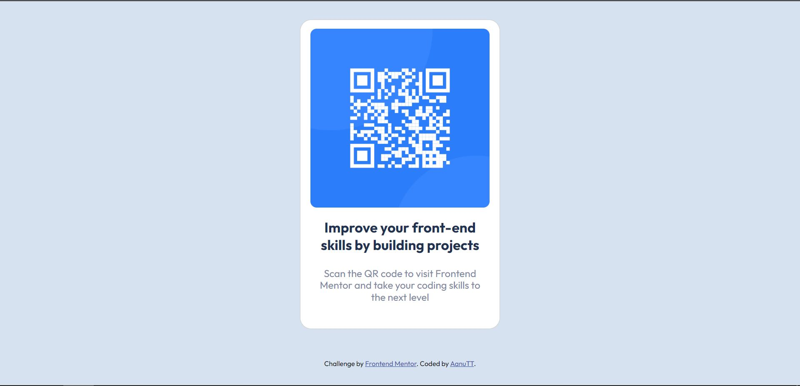

# Frontend Mentor - QR code component solution

## Table of contents
  
  - [Edit](#edit)
  - [Screenshot](#screenshot)
  - [Links](#links)
  - [Built with](#built-with)
  - [What I learned](#what-i-learned)
  - [Continued development](#continued-development)
  - [Useful resources](#useful-resources)
- [Author](#author)
- [Acknowledgments](#acknowledgments)

###Edit

initial link of previous work done 

### Screenshot

### Links

- Solution URL: 
- Live Site URL: 

### Built with

- Semantic HTML5 markup
- CSS custom properties
- Flexbox

### What I learned

Building this QR code, consolidated all i had learnt for over a month. I didn't think my learning was going anywhere, alas! This exercise showed me, I was actually learning. All I needed was application.

I understood the font-family import of new fonts better and finally got to use flex box!

### Continued development

I still require a lot of practice in code writing. I feel, the code could be neater. Suggestions and constructive criticism are much welcome.

### Useful resources

Google is a coder's best friend. I'm eager to see how much knowledge I'll draw from googling

## Author

- Frontend Mentor - [@AanuTT](https://www.frontendmentor.io/profile/AanuTT)
- Twitter - [@aanu_olu](https://www.twitter.com/aanu_olu)

## Acknowledgments

Frontend Mentor for creating this wonderful learning aid.

Thanks to [@0xabdulkhalid](https://www.0xabdulkhalid.ml/) for his useful comment. It helped in figuring out my this correction 

